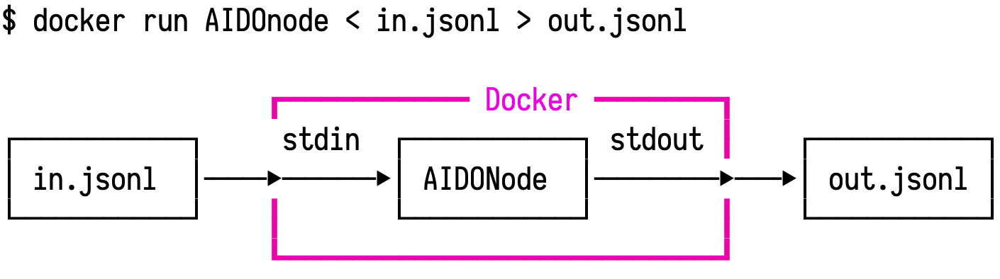

# AIDO Protocol {#part:aido-protocol status=ready}


This document describes the rationale and design for the AIDO protocol.

<div id="toc"></div>


# Goals and non-goals {status=ready}

## Goals

### Long shelf life

We want to obtain a library of modules that have a long "shelf life".

It should be easy to run "the line detector from 2018" in 2021.

### Flexibility

It should be possible to easily use a module in at least these scenarios:

* On the robot in real-time.
* Called as part of other modules ("module decorator").
* In a simulation, with the simulator both local (same host) or remote.
* In "batch mode", where the data is supplied from logs. 

It should be possible to run two instances of the same module / system on the same host.

It might be useful to think of the following use cases:

* A multi-robot simulator should run N agents, each specified as a container.

### Deterministic replay

It should be possible to apply the same module to the same data and obtain the same output. 

Example violation: current slimremote protocol runs simulation while it "waits" for the connection from the client.

### Deterministic uncertainty. 

There should be a clear way for modules to access a seed to use for their random number generators.

### Protocol checks

It should be explicit what protocol a module uses, and it should be easy to check to avoid incompatibilities. 

Example: Understanding whether I can pipe `p1` into `p2`.

### Resource limitation

Should be possible to give hard constraints on memory/cpu for each node.

### Protocol extendability

The protocols should support a notion of extension; so that we can say that not only `p1` is different from `p2`, but also that any agent using `p1` would work with `p2`.

*   Tracing latencies in the system.
*   Packages modules independently of middle-ware as much as possible. 

### Meta information

Nice to have some meta information in the module (who wrote, the description, etc.)

## Non-goals {status=ready}

### Ultimate speed. 

We are OK in accepting a performance hit.

(Note: did you know it takes 20ms to deserialize the line segment messages with ROS?)

## Why ROS is not a solution

"Using ROS" is not a solution, due to the following problems.

### Network trouble

ROS insists on having two processes need to know the other hosts not only by IP, but also by hostname. This causes a bunch of problems.

### Incompatibility

ROS 1 does not allow Python 3.

### Non-compositionality

It is not possible to run two ROS independent instances of a system on the same machine.


# The AIDONodes Protocol {status=ready}

## Overview

We go back to the UNIX philosophy. Nodes are executable that read and write to `stdin` to `stdout`.

The data that is moved across these sockets is encoded as JSONL: each line a well-formed JSON message. JSON Schema describes the format for the data. JSON also allows to add binary data (encoded as a base64 string).

(Note that JSONL is the log format that we use currently for AIDO; we use bags only for the videos.)

Each module comes in an executable. This executable is packaged in a Docker container.
The node is uniquely specified by the hash of the container.

## Low-level messaging interface

An aidonode communicates JSON packets in a request/response pattern along a pipe.

Experience shows that we would like to enforce the following:

* It should be possible to understand whether the container has read the data on the pipe.
* It should be possible to understand how many messages a container will send in response. In general a node replies with 0 or more messages for each message it receives.
* It should be possible to transmit the information "Between the last message and time t there were no other messages to consider".

We thus define the following messages.

Input messages to the aidonode:

* `DATA(time:Time, channel:str, data:object)`: a new message for the channel.
* `SILENCE(time:Time, channel:str)`: There was no message on the channel until time `time`.

Output messages of the aidonode:

* `READ(hash:Hash)`: acknowledgement of having *read* a message (but not necessarily having processed it.)
* `PROCESSED(hash:Hash, tofollow:int)`: Acknoweledgement that the processing in response to the message identified by `hash` will produce `tofollow` `DATA` messages, which will come directly after this message. 

Timestamps will be defined isomorphic to ROS.

## JSON encoding for low-level messaging interface

This is how the messages are encoded:

`DATA`:

```json
{"aidonode": "DATA", "time": ![time], "channel": ![channel name], "data": ![object]}
```
`SILENCE`:

```json
{"aidonode": "SILENCE", "time": ![time], "channel": ![channel name]}
```

`READ`:

```json
{"aidonode": "READ", "hash": ![hash]}
```

`PROCESSED`:

```json
{"aidonode": "PROCESSED", "hash": ![hash], "tofollow": ![number of packets]}
```

## Second-level interface and protocol

This is the level where we specify what kind of messages are accepted and produced by the nodes. 

The type of a message is specified through JSON Schema.

On top of that, we need to specify:

*   Which type of data for each channel.
*   What valid sequence of messages are accepted.

(Currently, at AIDO we have "names" for these protocols but the protocol itself is never formally specified.)

Examples:

*   An agent of type P1 accepts a sequence of images and outputs a series of commands ("left", "right" velocity signals).
*   An agent of type P2 accepts intrinsic and extrinsic image calibration data followed a sequence of images and outputs a series of commands ("left", "right" velocity signals).
*   An agent of type P3  accepts intrinsic and extrinsic image calibration data, a kinematic calibration file, followed a sequence of images and outputs a series of commands ("left", "right" PWM signals).
*   An agent of type P4  accepts extrinsic image calibration data, a kinematic calibration file, followed a sequence of *rectified* images and outputs a series of commands ("left", "right" PWM signals).

All of these are slighly different and failure of distinguishing between those caused much pain.

Note that once we have these formalized, we can also do automatic conversion of protocols. ("If you have an agent of type P1, you can create an agent of type P2 by..."")

## Interaction protocol formalization

One way to formalize the interaction protocols are via regular languages.

Define `in:![channel]` as the input channel and `out:![channel]` as the denotation of an output channel.

Let's formalize the following protocol:

"An agent that follows the protocol `LaneFilter` accepts one CameraCalibration message on the channel  `calibration`, followed by any number of images on the channel `image`, and to each image it will reply with a pose estimate on channel `estimate`."

As a formal language this can be written as:

```
LaneFilterLanguage := in:calibration (in:image out:estimate)*
```

In an hypothetical YAML description, we could write:

```yaml
LaneFilterProtocol:
	inputs:
		calibration: &CameraDataSchema
		image: &ImageSchema
	outputs:
		estimate: &Estimate
	interaction: >
		in:calibration (in:image out:estimate)*
```

This is then a formal description of the protocol; not only the data format, but also of the behavior of the component.

## Gains from formal definition 

We can then use the usual machinery of the field of formal languages to reason about composition and extendability.

### Extending interaction protocol

For example, we can describe backward-compatibility extensions of protocols.

Imagine that there is a lane filter who can also accept IMU data. But not always it will provide an updated pose from the IMU data.

Its language would be:

``` 
LaneFilterLanguage2 := in:calibration ( (in:image out:estimate) | (in:IMU out:estimate? ))*
```


It is possible (with some assumptions) to reason that LaneFilterLanguage1 is a sublanguage of LaneFilterLanguage2, so that an aidonode that implements the second can be used where the first would be used.

### Extending messages

Another possibility is where the data type is extended.

Already from JSON schema we have a notion of partial order. 

For example imagine a message with two fields:

```json
{"field1": ..., "field2": ...}
```

Adding a field should be a backward compatible change (we did this a few times with AIDO).

```json
{"field1": ..., "field2": ..., "extra_field": ...}
```

Here is how it looks like in JSON Schema.

Note that JSON Schema also allows defining various constraints (apart from the type, also minimum/maximum values etc.)

The first schema is:

```json
{
	"title": "Message v1",
	"description": "First version of the messages",
	"type": "object",
	"fields": {
        "field1": {
            "type": "integer",
            "exclusiveMinimum": 0,
        },
        "field2": {
            "type": "string"
        }
	}
}
```

The second schema is:

```json
{
	"title": "Message v1",
	"description": "First version of the messages",
	"type": "object",
	"fields": {
        "field1": {
            "type": "integer",
            "exclusiveMinimum": 0,
        },
        "field2": {
            "type": "string"
        },
        "extra_field": {
            "type": "string"
        }
	}
}
```


## User APIs

Needless to say, the user does not see anything of the above protocol.

Probably they will only need to do something like that:

```python
from duckietown_protocols import LaneFilterProtocol

class MyLaneFilter(LaneFilterProtocol):
	
	def on_received_image(self, image):
		# compute here
		....
		self.send_pose_estimate(pose_estimate)
```

## More detailed architecture

### ROS wrapper

<figure id="fig:wrapper">

</figure>

### Batch processing

<figure id="fig:batch">

</figure>

<style>
img { max-width: 100%; }
</style>